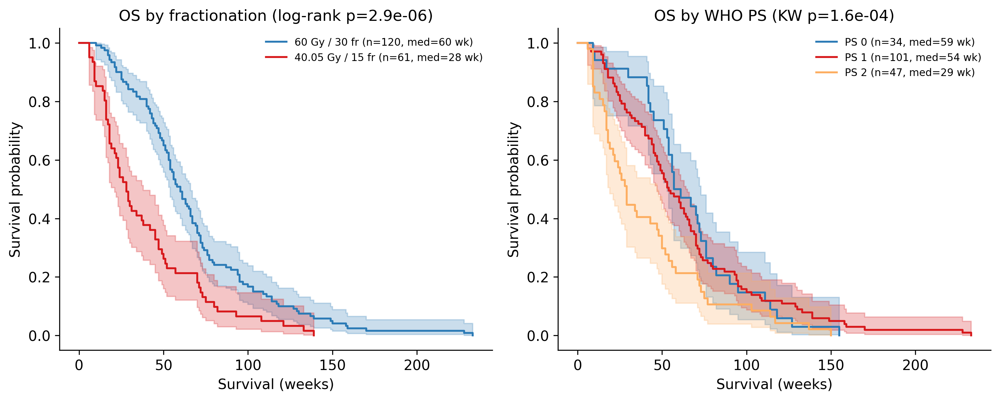
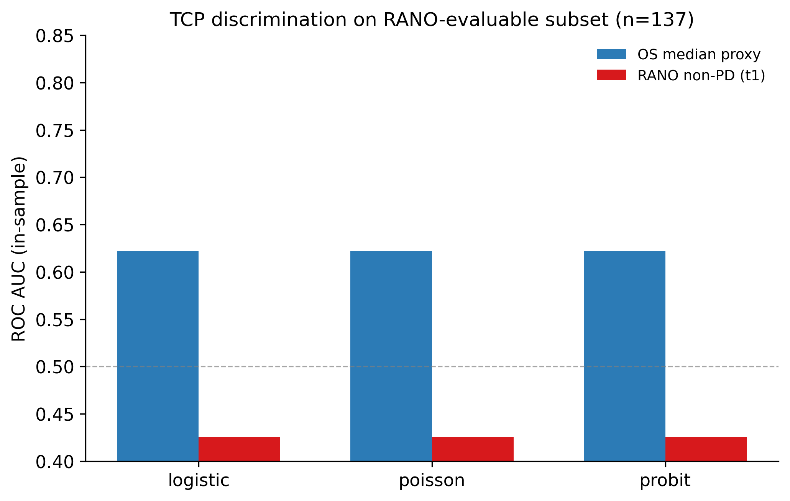

# TCP Modeling in Glioblastoma

Reproducible Python workflow for Tumor Control Probability (TCP) modeling in glioblastoma using the open-access CFB-GBM radiotherapy dataset from TCIA.

The pipeline covers DICOM-free NIfTI data curation, DVH feature extraction, Poisson / Logistic / Probit / EUD-based TCP model fitting with bootstrap confidence intervals, model comparison (AIC, BIC, ROC), and survival analysis (Kaplan-Meier, Cox regression).

**Dataset:** Moreau et al. 2025, *The Cancer Imaging Archive* — [doi:10.7937/V9PN-2F72](https://doi.org/10.7937/V9PN-2F72)  
**Cohort:** 190 / 264 patients for modeling after DVH QC (191 with RTDOSE + GTV; 1 excluded for invalid RTDOSE)  
**Task board:** [TASKS.md](TASKS.md) · [GitHub Issue #1](https://github.com/DmitriiZakharenko/tcp-modeling-gbm/issues/1) (sync: `bash scripts/sync_github_issue_1.sh`)

---

## Key findings (190-patient modeling cohort, verified)



| Finding | Result |
|---------|--------|
| **60 Gy / 30 fr vs 40.05 Gy / 15 fr** | median OS **60 vs 28 wk** (n=120 vs 61); log-rank **p ≈ 3×10⁻⁶** |
| **WHO performance status** | PS 0 → 59 wk, PS 2 → 29 wk; Kruskal–Wallis **p ≈ 1.6×10⁻⁴** |
| **Cox (age + sex + PS + scheme)** | scheme HR≈**0.54** (**p≈0.0007**), WHO PS HR≈**1.42** (**p≈0.001**) |
| **40 Gy arm (n=34 RANO)** | GTV volume → RANO non-PD: Poisson AUC **0.83**, LR **p≈0.037** |
| **60 Gy arm (n=96 RANO)** | GTV volume → RANO: Spearman **p≈0.019**, AUC **0.66** (exploratory) |
| **Cox + RANO (n=137)** | RANO non-PD HR≈**0.48** (**p≈0.0009**); EQD2 still significant after adjustment |

Full tables: [`reports/RESULTS.md`](reports/RESULTS.md) · regenerate with `make report`

---

## CFB-GBM v3 data + RANO endpoint (2026-06 update)

Downloaded **Version 3** supplementary TSVs from TCIA (`python -m src.data.download_clinical_data`):

- RANO criteria, MRI/CT availability, updated imaging metadata, PyRadiomics features
- Merged into `cohort.csv` / `modeling_table.csv` (**58 columns**, incl. `rano_t0_t1`, `rano_controlled_t1`, `rt_delay_wk`, BMI, …)



| Endpoint | n | Poisson AUC (EQD2) | LR p vs null |
|----------|---|---------------------|--------------|
| OS ≥ median (full cohort) | 190 | **0.68** | ≈ 3×10⁻⁶ |
| OS ≥ median (RANO subset) | 137 | **0.62** | ≈ 0.01 |
| **RANO non-PD at t1** | 137 | **0.43** | **1.0** (no signal) |

**Verdict:** RANO data **was missing from our v02 snapshot**, not absent from the dataset — but **pooled EQD2→RANO TCP does not improve** vs OS proxy. On the same 137 patients, higher EQD2 (60 Gy arm) correlates with **more PD** at t1 (27% vs 15% in 40 Gy arm) despite better OS — scheme/confounding again. Within-arm dose spread still ≈0 → classical DVH-TCP unchanged.

---

## TCP modeling: what we can and cannot do with CFB-GBM

**The assignment (build TCP pipeline) — yes, done:** Poisson / Logistic / Probit / EUD models, MLE, bootstrap CI, model comparison, calibration plots (`make report`).

**Classical TCP validation (D50/γ50 vs true tumor control) — still limited:**

| Limitation | Verified fact |
|------------|----------------|
| **Endpoint** | OS always available; **RANO v3** gives imaging response (137/190 with t0→t1) — closer than OS but ≠ formal LC |
| **RANO + pooled EQD2** | AUC **0.43** on same patients where OS proxy AUC **0.62** — dose scheme confounds early imaging response |
| **No dose spread within arm** | 60 Gy: GTV Dmean SD = **0.28 Gy** → DVH-TCP within protocol underpowered |
| **Confounding** | r(age, EQD2) = **−0.57**; 60 Gy younger (median **65 vs 75 yr**) |

Audit: `python -m src.analysis.confounding_audit`

---

## Project Structure

```
tcp-modeling-gbm/
├── data/
│   ├── raw/          # NIfTI files (RTDOSE + GTV) — not versioned
│   └── processed/    # Cohort CSV, feature tables, clinical TSVs
├── notebooks/        # Analysis notebooks (run in order: 01 → 05)
├── src/
│   ├── config.py     # Central paths and constants
│   ├── data/         # Cohort builder, NIfTI loader, DVH calculator, downloader
│   ├── models/       # TCP model classes, bootstrap CI, model comparison
│   ├── analysis/     # Stratified clinical tests, TCP feasibility audit
│   └── utils/        # Plotting helpers
├── figures/          # Exported figures (300 dpi PNG + PDF)
├── reports/          # Report sections and literature table
└── requirements.txt
```

## Setup

```bash
git clone https://github.com/DmitriiZakharenko/tcp-modeling-gbm.git
cd tcp-modeling-gbm
pip install -r requirements.txt
```

## Data

### Included in the repository (no NIfTI required)

| File | Description |
|------|-------------|
| `data/processed/cohort.csv` | 264 patients; 190 modeling-eligible after DVH QC |
| `data/processed/modeling_table.csv` | Included cohort + clinical/RANO fields + DVH metrics (190×58) |
| `data/processed/CFB-GBM_*.tsv` | Source clinical / treatment tables from TCIA |

`modeling_table.csv` columns: `patient_id`, `rt_dose_gy`, `n_fractions`, `eqd2_gy`, `survival_weeks`, `age`, `sex`, `who_status`, DVH metrics (`D2_gy` … `D98_gy`, `Vx_pct`, `gEUD_*`, `HI_gy`, `volume_cc`).

```python
import pandas as pd
df = pd.read_csv("data/processed/modeling_table.csv")
```

### Local-only (large; not in git)

| Path | Size | Role |
|------|------|------|
| `data/raw/` | ~52 GB | RTDOSE + GTV NIfTI per patient |
| `data/processed/dvh_curves/`, `dose_slices/`, `dvh_curves_all.npz` | ~130 MB | Full DVH curves and axial slices (optional; regenerate from raw) |

### Regenerate processed tables from NIfTI

```bash
make process
# verify-rt → feature_builder → export modeling_table.csv
```

Requires `data/raw/{patient_id}/t0/*_t0_rtdose.nii.gz` and `*_t0_gtv.nii.gz` for all modeling-eligible patients.

### Results report (update after each analysis commit)

```bash
make report
# or: python -m src.reporting.update_results
```

Writes:

| Output | Description |
|--------|-------------|
| [`reports/RESULTS.md`](reports/RESULTS.md) | Human-readable snapshot: cohort stats, model metrics, figure links |
| `reports/metrics/*.csv` | Machine-readable tables (cohort, survival, TCP quality, DVH summary) |

All numbers are recomputed from `data/processed/modeling_table.csv` — no hand-entered values.

### Download NIfTI from TCIA

When direct `ascp` (port 33001) is blocked, use IBM Aspera Connect:

```bash
python -m src.data.download_rt_connect
python -m src.data.organize_raw_data --import-from /path/to/downloads --move  # if needed
```

Fallback: `python -m src.data.download_rt_files` or manual download from [CFB-GBM on TCIA](https://www.cancerimagingarchive.net/collection/cfb-gbm/) (RTDOSE + GTV NIfTI only, ~70–80 GB).

Full pipeline:

```bash
make data              # TSVs + cohort + download + verify
python -m src.data.setup_data --skip-rt --features --workers 4
```

## Usage

```bash
# Build cohort table
python -m src.data.cohort_builder

# Run notebooks in order
jupyter notebook notebooks/
```

## Reproducibility

All notebooks are designed to run top-to-bottom (`Kernel → Restart & Run All`) without errors.  
Random seed: `42`. Python 3.9+.

## Citation

```
Moreau, N. N., et al. (2025). Pre and post treatment MRI and radiotherapy plans
of patients with glioblastoma: the CFB-GBM cohort. The Cancer Imaging Archive.
https://doi.org/10.7937/V9PN-2F72
```

## License

Code: [GPL-3.0](LICENSE). CFB-GBM dataset: [CC BY 4.0](https://creativecommons.org/licenses/by/4.0/) (see [TCIA data usage policy](https://www.cancerimagingarchive.net/data-usage-policy-and-restrictions/)).
